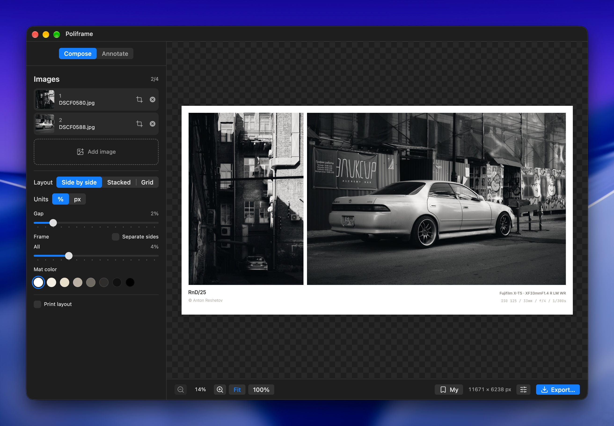

<p align="center">
  
</p>

<h1 align="center">Poliframe</h1>

<p align="center">
  A free, open-source photo composition app.
</p>

<p align="center">
  <strong>Combine photos into clean diptychs, photo strips and custom grids.</strong>
  <br>
  Add captions, frame your photographs, and prepare them for sharing or print.
</p>

<p align="center">
  
  
  
  
</p>

<p align="center">
  <a href="https://github.com/antonreshetov/poliframe/releases">Releases</a> &nbsp;|&nbsp;
  <a href="https://github.com/antonreshetov/poliframe/issues">Report a bug</a>
</p>

<br>

<p align="center">
  
</p>

<p align="center">
  <sub>For macOS, Windows, and Linux</sub>
</p>

## About

Poliframe started as my [native macOS app](https://apps.apple.com/us/app/poliframe/id6782919187?mt=12). This version brings it to Windows and Linux while also supporting macOS.

## Features

### Compose

- Arrange photographs side by side, vertically, or in a grid
- Split grid cells and drag dividers to create your own layout
- Hold <kbd>Option</kbd> on macOS or <kbd>Alt</kbd> on Windows/Linux while dragging to move just one segment of a grid divider
- Drag and drop images to reorder them or swap cells
- Crop, rotate, and flip photographs
- Adjust spacing, frame widths, and mat color
- Save your settings as reusable presets

### Annotate

- Choose from seven caption styles with bundled fonts
- Add a title, copyright, and camera settings from EXIF metadata
- Show captions for the composition or under each photo
- Adjust caption size and padding
- Add a logo watermark

### Prepare for Print

- Choose a paper size and orientation
- Fit the composition to the page or fill it
- Check the effective DPI for the selected print size

### Export

- Save as JPEG, PNG, or TIFF, with 16-bit output for PNG and TIFF
- Keep automatic dimensions or specify a width, height, or scale
- Export in sRGB, Display P3, or Adobe RGB when the profile is available
- Include metadata from a selected source photograph
- Reveal the exported file directly from the completion notification

Need smaller files for the web? Try my [Image Optimizer](https://github.com/antonreshetov/image-optimizer) to optimize your exported images.

Import JPEG, PNG, TIFF, WebP, and AVIF images.

## Contributions

Poliframe currently accepts bug reports only. Feature requests and external pull requests are not accepted.

To report a bug, [open an issue](https://github.com/antonreshetov/poliframe/issues) with your operating system, app version, and steps to reproduce the problem.

## Build Locally

<details>
<summary>Instructions for building from source</summary>

### Prerequisites

- Node.js 24.14.0 or newer
- pnpm 10.29.2 or newer within version 10

### Install Dependencies

```sh
pnpm install --frozen-lockfile
```

### Development

```sh
pnpm dev
```

### Checks

```sh
pnpm typecheck
pnpm lint
pnpm test
```

### Build

Build for the current platform:

```sh
pnpm build
```

Platform-specific builds:

```sh
pnpm build:mac
pnpm build:win
pnpm build:linux
```

The macOS release build requires signing and notarization credentials. To build locally without them:

```sh
pnpm build:mac:local
```

Build artifacts are written to `dist`.

</details>

## Follow

News and updates on [X](https://x.com/anton_reshetov).

## License

[AGPL-3.0](./LICENSE)

Copyright (c) 2021-present, [Anton Reshetov](https://github.com/antonreshetov).

Bundled fonts retain their own licenses. See [resources/licenses](./resources/licenses).
